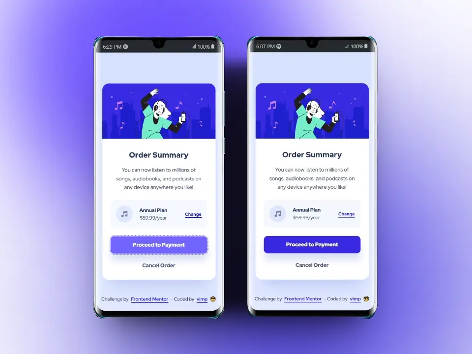
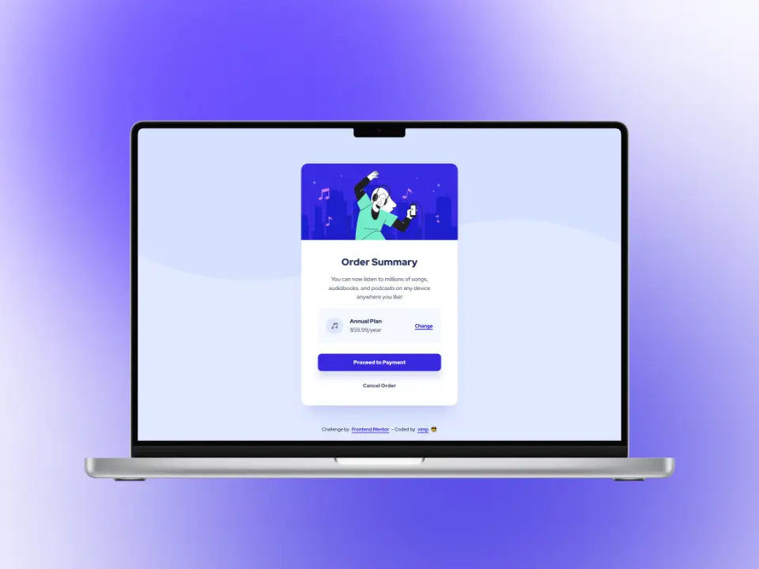

# Frontend Mentor - Order summary card solution

This is a solution to the [Order summary card challenge on Frontend Mentor](https://www.frontendmentor.io/challenges/order-summary-component-QlPmajDUj).

Frontend Mentor challenges help you improve your coding skills by building realistic projects.


## Table of contents

- [Overview](#overview)
  - [The challenge](#the-challenge)
  - [Screenshot](#screenshot)
  - [Links](#links)
- [My process](#my-process)
  - [Built with](#built-with)
  - [What I learned](#what-i-learned)
  - [Useful resources](#useful-resources)
- [Author](#author)

## Overview

### The challenge

Users should be able to:

📌 See hover states for interactive elements

### Screenshot

#### 📱 Mobile



#### 💻 Desktop



### Links

[Demo](https://mendez-v.github.io/order-summary-component/) 👀

<!-- [Frontend Mentor](https://your-solution-url.com)👀 -->

## My process

### Built with

🎯 Semantic HTML5 markup

🎯 CSS custom properties

🎯 CSS Grid

🎯 Mobile-first workflow


### What I learned

✅ In this code the style rules for `:focus-visible` and `:hover` are the same. However they are kept separate to avoid unwanted hover effects on touch devices.
```css
.btn:focus-visible {
  color: var(--neutral);
  background-color: var(--hover-bg);  
}

@media (hover:hover) {
  .btn:hover {
    color: var(--neutral);
    background-color: var(--hover-bg);
  }
}
```

### Useful resources

🖼 Favicon - [Music](https://iconscout.com/3d-illustrations/music) by [Gandino J.](https://iconscout.com/contributors/jabar-gandino) on [IconScout](https://iconscout.com" class="text-underline font-size-sm)

🖥 [Use these instead of vh](https://www.youtube.com/watch?v=ru3U8MHbFFI) by Kevin Powell

## Author

✨ Frontend Mentor - [@mendez-v](https://www.frontendmentor.io/profile/mendez-v)
